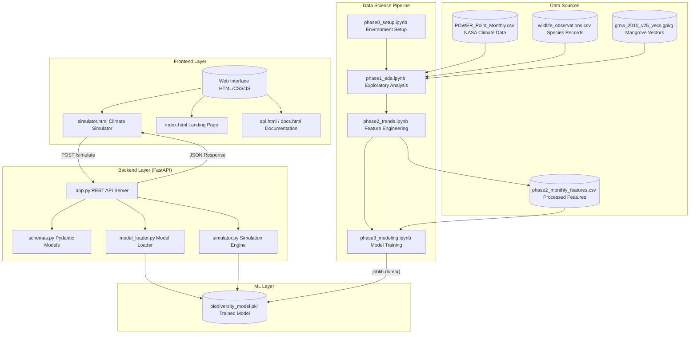

# Sundarbans Biodiversity AI - Technical Documentation

**Project:** AI-Driven Biodiversity Prediction System  
**Location:** Sundarbans Mangrove Forest, West Bengal, India  
**Date:** February 2026

---

## Table of Contents

1. [Project Overview](#project-overview)
2. [High-Level System Architecture](#high-level-system-architecture)
3. [Workflow Overview](#workflow-overview)
4. [Architecture Explanation](#architecture-explanation)
5. [Dataset Description](#dataset-description)
6. [Feature Vector](#feature-vector)
7. [API Reference](#api-reference)

---

## Project Overview

The Sundarbans Biodiversity AI project is a climate-driven biodiversity simulation engine that predicts how temperature and humidity changes impact species richness in the Sundarbans mangrove ecosystem. The system uses machine learning models trained on NASA climate data and GBIF wildlife observations.

**Key Features:**
- Real-time climate scenario simulation
- Species richness prediction
- Risk level assessment (High/Moderate/Low)
- Interactive web-based simulator

---

## High-Level System Architecture



---

## Workflow Overview

```mermaid
flowchart LR
    subgraph Input["Data Ingestion"]
        A1["NASA POWER API Climate Data"]
        A2["Wildlife Survey Observations"]
        A3["Global Mangrove Watch GeoPackage"]
    end

    subgraph Processing["Data Processing"]
        B1["Load & Clean Raw Datasets"]
        B2["Merge Climate + Wildlife Data"]
        B3["Feature Engineering Lag Variables"]
        B4["Train/Test Split"]
    end

    subgraph Training["Model Training"]
        C1["Random Forest / Gradient Boosting"]
        C2["Cross-Validation Hyperparameter Tuning"]
        C3["Model Evaluation R², MAE, RMSE"]
        C4["Export Model joblib.dump()"]
    end

    subgraph Serving["Model Serving"]
        D1["FastAPI Server Load Model"]
        D2["Validate Input Pydantic Schema"]
        D3["Run Prediction model.predict()"]
        D4["Calculate Risk Level Assessment"]
    end

    subgraph Output["Results"]
        E1["Baseline Prediction"]
        E2["Scenario Prediction"]
        E3["Delta Change"]
        E4["Risk Classification High/Moderate/Low"]
    end

    subgraph User["User Interface"]
        F1["Configure Climate Parameters"]
        F2["Adjust Lag Variables"]
        F3["View Results & Gauges"]
        F4["Export Report"]
    end

    A1 --> B1
    A2 --> B1
    A3 --> B1
    B1 --> B2
    B2 --> B3
    B3 --> B4

    B4 --> C1
    C1 --> C2
    C2 --> C3
    C3 --> C4

    C4 --> D1
    D1 --> D2
    D2 --> D3
    D3 --> D4

    D4 --> E1
    D4 --> E2
    D4 --> E3
    D4 --> E4

    F1 --> D2
    F2 --> D2
    E1 --> F3
    E2 --> F3
    E3 --> F3
    E4 --> F3
    F3 --> F4
```



---

## Architecture Explanation

### 1. Frontend Layer

| Component | File | Purpose |
|-----------|------|---------|
| Landing Page | index.html | Project introduction, hero section, FAQ |
| Climate Simulator | simulator.html + simulator.js | Interactive sliders for 10 climate parameters |
| Documentation | api.html, docs.html | API reference & usage guides |

The frontend communicates with the backend via HTTP POST requests to `/simulate`.

### 2. Backend Layer

| Component | File | Role |
|-----------|------|------|
| API Server | app.py | FastAPI app with CORS, routes `/` and `/simulate` |
| Schemas | schemas.py | Pydantic validation for SimulationInput (10 features) and SimulationOutput |
| Model Loader | model_loader.py | Loads biodiversity_model.pkl via joblib |
| Simulation Engine | simulator.py | Prepares features, runs prediction, calculates risk level |

### 3. ML Layer

- **biodiversity_model.pkl** — Pre-trained scikit-learn model (Random Forest/Gradient Boosting)
- Predicts species richness based on temperature + humidity features with lag variables

### 4. Data Science Pipeline

Sequential Jupyter notebooks that prepared the model:

| Notebook | Purpose |
|----------|---------|
| phase0_setup | Environment setup, library imports |
| phase1_eda | Exploratory data analysis, missing values, distributions |
| phase2_trends | Feature engineering (lag variables: T2M_lag_1/3/6, RH2M_lag_1/3/6) |
| phase3_modeling | Model training, cross-validation, export |

### 5. Data Sources

| File | Description |
|------|-------------|
| POWER_Point_Monthly...csv | NASA POWER API climate data (temperature, humidity) |
| wildlife_observations.csv | Species observation records from GBIF |
| gmw_2010_v25_vecs.gpkg | Global Mangrove Watch spatial boundaries |
| phase2_monthly_features.csv | Merged & engineered features for modeling |

---

## Dataset Description

### Climate Variables (NASA POWER Data)

**Source:** NASA POWER API — Monthly satellite-derived climate data  
**Location:** Latitude 21.9°N, Longitude 88.9°E (Sundarbans region, West Bengal)  
**Period:** January 2020 – December 2025

| Variable | Full Name | Unit | Description |
|----------|-----------|------|-------------|
| T2M | Temperature at 2 Meters | °C | Air temperature measured 2m above ground |
| RH2M | Relative Humidity at 2 Meters | % | Humidity measured 2m above ground |
| IMERG_PRECTOT | Total Precipitation | mm/day | Rainfall (unavailable in this dataset) |

**Sample Values (2020):**

| Month | T2M (°C) | RH2M (%) |
|-------|----------|----------|
| January | 18.15 | 73.36 |
| April | 29.66 | 66.88 |
| July | 28.93 | 87.13 |
| October | 27.89 | 85.32 |

### Biodiversity Target Variable

**Source:** GBIF (Global Biodiversity Information Facility) — Wildlife observations  
**Target:** `species` — Monthly species count (unique species observed)

| Attribute | Description |
|-----------|-------------|
| Variable Name | species |
| Type | Integer (count) |
| Baseline | 180 species (reference standard) |
| Range | ~70 – 210 species/month |
| Meaning | Number of distinct species recorded in Sundarbans per month |

**Sample Wildlife Records (GBIF):**

| Species | Family | Location | Date |
|---------|--------|----------|------|
| Acraea terpsicore | Nymphalidae | 22.36°N, 88.39°E | 2021-12-23 |
| Tirumala limniace | Nymphalidae | 22.36°N, 88.39°E | 2024-11-10 |
| Danaus genutia | Nymphalidae | 22.36°N, 88.39°E | 2024-11-10 |
| Eurema hecabe | Pieridae | 22.36°N, 88.39°E | 2021-12-23 |

---

## Feature Vector

The model uses **10 features** combining current climate conditions and temporal lag features to capture both immediate conditions and climate memory effects.

### Feature Order

```python
FEATURE_ORDER = [
    "humidity",        # Current RH2M
    "air_temperature", # Current T2M
    "temp_lag_3",      # Temperature 3 months ago
    "hum_lag_3",       # Humidity 3 months ago
    "T2M_lag_1",       # Temperature 1 month ago
    "RH2M_lag_1",      # Humidity 1 month ago
    "T2M_lag_3",       # T2M 3 months prior
    "RH2M_lag_3",      # RH2M 3 months prior
    "T2M_lag_6",       # T2M 6 months prior
    "RH2M_lag_6"       # RH2M 6 months prior
]
```

### Feature Breakdown

| # | Feature | Type | Range | Description |
|---|---------|------|-------|-------------|
| 1 | humidity | Current | 0-100% | Current month relative humidity |
| 2 | air_temperature | Current | 10-45°C | Current month temperature |
| 3 | temp_lag_3 | Lag | °C | Temperature from 3 months ago |
| 4 | hum_lag_3 | Lag | % | Humidity from 3 months ago |
| 5 | T2M_lag_1 | Lag | °C | Temperature from 1 month ago |
| 6 | RH2M_lag_1 | Lag | % | Humidity from 1 month ago |
| 7 | T2M_lag_3 | Lag | °C | Temperature from 3 months ago |
| 8 | RH2M_lag_3 | Lag | % | Humidity from 3 months ago |
| 9 | T2M_lag_6 | Lag | °C | Temperature from 6 months ago |
| 10 | RH2M_lag_6 | Lag | % | Humidity from 6 months ago |

### Why Lag Features?

Biodiversity response to climate is **delayed**:

- **1-month lag** — Immediate seasonal transition effects
- **3-month lag** — Breeding/migration cycle impacts
- **6-month lag** — Long-term ecological memory (monsoon to dry season)

### Processed Dataset Sample

| Date | species | humidity | air_temp | temp_lag_3 | hum_lag_3 | T2M_lag_1 | RH2M_lag_1 | T2M_lag_3 | RH2M_lag_3 | T2M_lag_6 | RH2M_lag_6 |
|------|---------|----------|----------|------------|-----------|-----------|------------|-----------|------------|-----------|------------|
| 2020-01 | 192 | 73.36 | 18.15 | — | — | — | — | — | — | — | — |
| 2020-04 | 72 | 66.88 | 29.66 | 18.15 | 73.36 | 26.24 | 67.19 | 18.15 | 73.36 | — | — |
| 2020-07 | 156 | 87.13 | 28.93 | 29.66 | 66.88 | 29.06 | 86.68 | 29.66 | 66.88 | 18.15 | 73.36 |

---

## API Reference

### Endpoint: POST /simulate

**URL:** `http://localhost:3005/simulate`

### Request Body (SimulationInput)

```json
{
  "air_temperature": 32,
  "humidity": 60,
  "temp_lag_3": 30,
  "hum_lag_3": 65,
  "T2M_lag_1": 31,
  "RH2M_lag_1": 62,
  "T2M_lag_3": 29,
  "RH2M_lag_3": 68,
  "T2M_lag_6": 27,
  "RH2M_lag_6": 75
}
```

### Response Body (SimulationOutput)

```json
{
  "baseline": 180.0,
  "prediction": 162.35,
  "delta": -17.65,
  "risk_level": "High Risk"
}
```

### Risk Level Classification

| Delta (δ) | Risk Level | Interpretation |
|-----------|------------|----------------|
| δ < -15 | High Risk | Severe biodiversity decline expected |
| -15 ≤ δ < -5 | Moderate Risk | Noticeable species reduction |
| δ ≥ -5 | Low Risk | Biodiversity remains stable |

### Health Check

**Endpoint:** `GET /`

**Response:**
```json
{
  "status": "Sundarbans AI backend running"
}
```

---

## Technology Stack

| Layer | Technology |
|-------|------------|
| Frontend | HTML5, CSS3, JavaScript, GSAP |
| Backend | Python, FastAPI, Uvicorn |
| ML/Data Science | scikit-learn, pandas, numpy, matplotlib |
| Data Validation | Pydantic |
| Model Serialization | joblib |
| Geospatial | geopandas, shapely, rasterio |

---

## Project Structure

```
ai_biodiversity_sundarbans/
├── backend/
│   ├── app.py              # FastAPI server
│   ├── schemas.py          # Pydantic models
│   ├── model_loader.py     # Model loading utility
│   ├── simulator.py        # Simulation engine
│   └── app/
│       └── main.py         # Alternative FastAPI entry
├── frontend/
│   ├── index.html          # Landing page
│   ├── simulator.html      # Climate simulator
│   ├── simulator.js        # Simulator logic
│   ├── styles.css          # Main styles
│   └── simulator.css       # Simulator styles
├── data/
│   ├── POWER_Point_Monthly...csv    # NASA climate data
│   ├── wildlife_observations.csv    # GBIF species data
│   ├── gmw_2010_v25_vecs.gpkg       # Mangrove boundaries
│   └── phase2_monthly_features.csv  # Processed features
├── models/
│   └── biodiversity_model.pkl       # Trained ML model
├── notebooks/
│   ├── phase0_setup.ipynb
│   ├── phase1_eda.ipynb
│   ├── phase2_trends_relationships.ipynb
│   └── phase3_modeling.ipynb
└── requirements.txt
```

---

**Document Generated:** February 2026  
**Repository:** github.com/Sasanka14/ai_biodiversity_sundarbans
